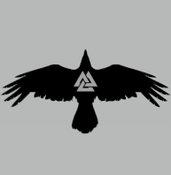

<html>
<head>

<title> TARIK SELIMOVIC </title>
</head>

<body>

<h1> 
 TARIK SELIMOVIC RESUME 
 </h1>

  
  

 

 

    

 
 <a href="https://www.norsesouls.com/" target="_blank">CLICK HERE TO VISIT NORSE SOULS! </a> 

&nbsp;

  

&nbsp;

 <a href="https://www.instagram.com/norsesouls/?hl=en/" target="_blank">OUR INSTAGRAM! </a> 

&nbsp;

 

    

<table border="4" cellpadding="2" cellspacing="2" width="100%">
<tr>
<td>TARIK SELIMOVIC</td>
<td>180302001</td>
</tr>
</table>

<h3>Click on the tabs below:</h3>
  

    <a href="https://www.facebook.com/tarik.selimovic.560" target="_blank"><button >Facebook</button></a>
    <a href="https://www.instagram.com/elcakfo/?hl=en/" target="_blank"><button >Instagram</button></a>
    <a href="https://goo.gl/maps/q9AAw2KfkFwH9WqU9" target="_blank"><button>Location</button></a>
  

  

    <h3>Student </h3>
  

  

    <h3>My Company </h3>
  

  

    <h3>support@norsesouls.com</h3>

</body>
</html>
<script>
function clickHandle(evt, tabName) {
  let i, tabcontent, tablinks;

  tabcontent = document.getElementsByClassName("tabcontent");
  for (i = 0; i < tabcontent.length; i++) {
    tabcontent[i].style.display = "none";
  }

  tablinks = document.getElementsByClassName("tablinks");
  for (i = 0; i < tablinks.length; i++) {
    tablinks[i].className = tablinks[i].className.replace(" active", "");
  }

  document.getElementById(tabName).style.display = "block";
  evt.currentTarget.className += " active";
}

